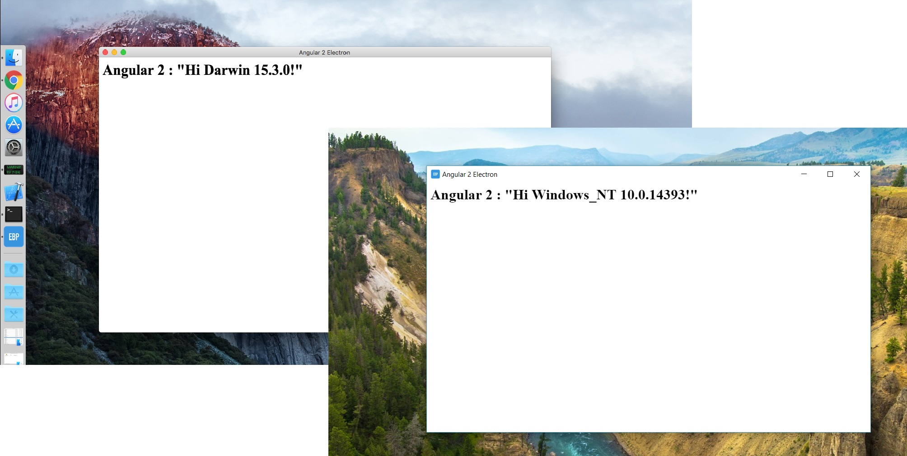

# Angular 2 Electron Boilerplate #

Boilerplate application for building cross-platforms desktop applications using Angular 2, HTML and CSS.



This project is adoption of Angular 2 to original electron boilerplate project (https://github.com/szwacz/electron-boilerplate).

## Packages ##

* Electron
* Angular 4
* Typescript 2.3
* SASS

## Getting Started ##

NodeJs required.

```
git clone https://github.com/Dorokhov/angular2-electron-boilerplate
cd angular2-electron-boilerplate
npm install
npm start
```

## Adding NPM Packages ##

Application NPM packages should be added to '/renderer/app/packages.json' config file.

## Making Release ##

Run following command to create installer for Windows, MAC OS and Linux under '/releases' folder:

```
npm run release
```

